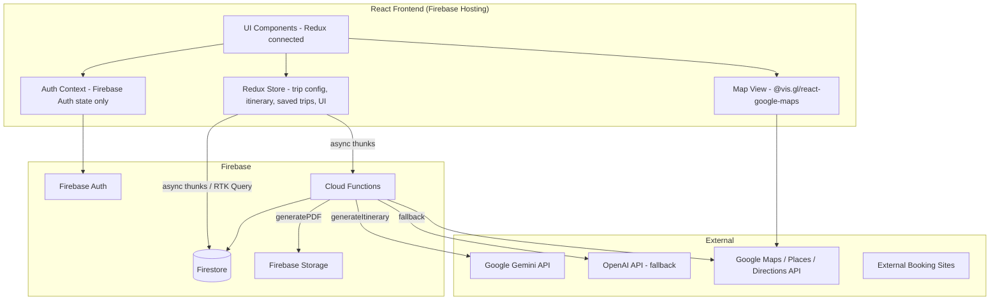
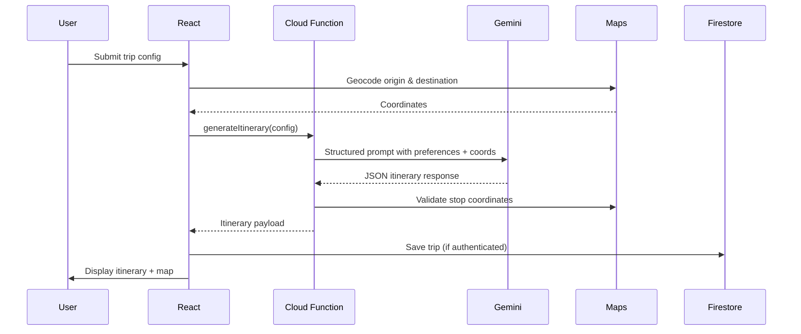
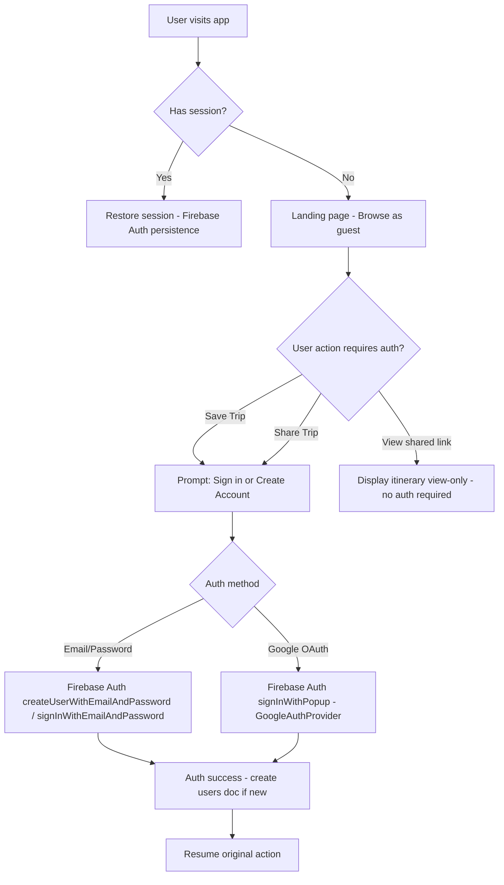
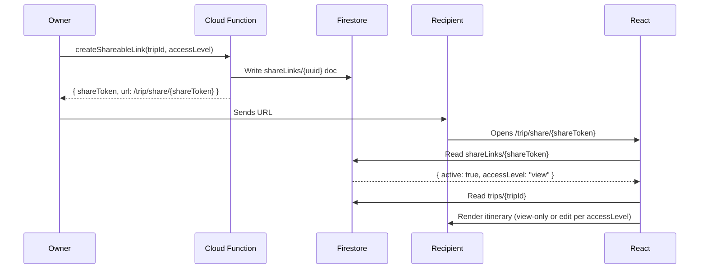
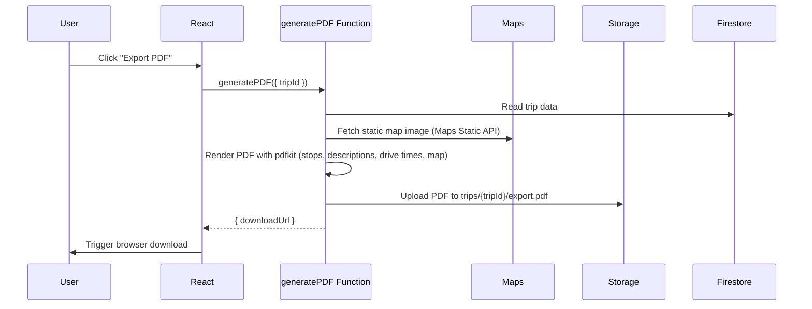

# Design Document: Road Trip Planner (RoadDoggs)

## Overview

RoadDoggs is a web application that lets users plan personalized road trips powered by AI. Users configure a trip with an origin, destination, travel dates, themed preferences, pacing, and accommodation preferences. An AI engine generates a curated itinerary with stops, drive times, and lodging recommendations. Users can customize, save, share, and export their itineraries.

**Tech Stack Summary**

- Frontend: React (JavaScript), hosted on Firebase Hosting
- State Management: Redux Toolkit (RTK) for global app state; React Context for Firebase Auth state only
- Backend: Firebase (Firestore, Firebase Auth, Firebase Storage, Cloud Functions)
- AI: Google Gemini via Cloud Functions (primary; OpenAI GPT-4o as fallback/alternative)
- Maps: Google Maps JavaScript API + Places API (New) + Directions API
- PDF: `pdfkit` running inside a Cloud Function, output stored in Firebase Storage

**Key Design Decisions**

- AI calls are proxied through Cloud Functions to keep API keys server-side and enforce rate limiting.
- Google Gemini is preferred because it shares the same Google Cloud billing account as Firebase, simplifying setup. The AI adapter is abstracted so swapping to OpenAI requires only a config change.
- PDF generation is server-side (Cloud Function + pdfkit) rather than client-side (jsPDF) to support static map image embedding and consistent rendering across devices.
- Google Maps is chosen over Mapbox because the Places API (New) provides geocoding, autocomplete, and directions in a single billing relationship.
- Firestore is used as the primary database; its real-time listeners power collaborative editing for shared trips.
- Redux Toolkit is used for global client state (trip config, itinerary, saved trips, UI state). Firebase Auth state is kept in React Context via `onAuthStateChanged` because it is managed entirely by the Firebase SDK and does not benefit from Redux's action/reducer model.

---

## Architecture



### Request Flow: Itinerary Generation



---

## Components and Interfaces

### Component Tree

```
App
├── AuthProvider                          (React Context — Firebase Auth state)
│   └── Provider (Redux store)
│       └── Router
│           ├── LandingPage
│           ├── TripPlannerPage           (Redux connected)
│           │   ├── TripConfigPanel       (Redux connected — reads/writes tripConfigSlice)
│           │   │   ├── LocationInputs        (origin, destination + Places autocomplete)
│           │   │   ├── DateRangePicker
│           │   │   ├── PreferenceSelector    (preset chips + custom free-text)
│           │   │   ├── PacingSelector        (preset + editable mileage; local state until submit)
│           │   │   └── AccommodationPanel
│           │   │       ├── AccomPreferenceSelector
│           │   │       └── BudgetInputs
│           │   ├── ItineraryView         (Redux connected — reads itinerarySlice)
│           │   │   ├── MapView               (@vis.gl/react-google-maps)
│           │   │   ├── StopList              (drag-and-drop via @dnd-kit)
│           │   │   │   └── StopCard
│           │   │   ├── AccommodationList
│           │   │   │   └── AccommodationCard
│           │   │   └── TripSummaryBar        (total distance, total time)
│           │   └── TripActionBar             (Save, Export PDF, Share — Redux connected)
│           ├── SavedTripsPage            (Redux connected — reads savedTripsSlice)
│           │   └── TripCard
│           ├── SharedTripPage                (view-only or edit based on access level)
│           └── AuthPage                      (sign in / sign up)
```

### Key Component Interfaces

```javascript
// TripConfig — the input shape passed to the AI engine
{
  origin: { address: string, lat: number, lng: number },
  destination: { address: string, lat: number, lng: number },
  startDate: string | null,          // ISO date
  endDate: string | null,
  preferences: string[],             // e.g. ["Scenic", "Food & Drink", "my custom pref"]
  pacing: {
    preset: "Leisurely" | "Moderate" | "Aggressive" | "Custom",
    maxMilesPerLeg: number           // editable threshold
  },
  accommodation: {
    preferences: string[],
    nightlyBudget: number | null,    // user's local currency
    tripBudget: number | null
  }
}

// Itinerary — the output shape returned by the AI engine
{
  tripId: string,
  legs: Leg[],
  totalDistanceMiles: number,
  totalDriveTimeMinutes: number
}

// Leg
{
  legIndex: number,
  date: string | null,
  stops: Stop[],
  distanceMiles: number,
  driveTimeMinutes: number,
  accommodation: Accommodation | null
}

// Stop
{
  stopId: string,
  name: string,
  address: string,
  lat: number,
  lng: number,
  preferenceTag: string,
  description: string,              // >= 20 words
  driveTimeFromPrevMinutes: number,
  distanceFromPrevMiles: number
}

// Accommodation
{
  accommodationId: string,
  name: string,
  address: string,
  lat: number,
  lng: number,
  preferenceTag: string,
  estimatedNightlyRate: number,
  bookingLinks: { platform: string, url: string }[]
}
```

### Cloud Function Interfaces

| Function                  | Trigger        | Input                                   | Output                                |
| ------------------------- | -------------- | --------------------------------------- | ------------------------------------- |
| `generateItinerary`       | HTTPS Callable | `TripConfig`                            | `Itinerary`                           |
| `generateAlternativeStop` | HTTPS Callable | `{ stopId, preferenceTag, tripConfig }` | `Stop`                                |
| `generatePDF`             | HTTPS Callable | `{ tripId }`                            | `{ downloadUrl: string }`             |
| `createShareableLink`     | HTTPS Callable | `{ tripId, accessLevel }`               | `{ shareToken: string, url: string }` |
| `revokeShareableLink`     | HTTPS Callable | `{ tripId, shareToken }`                | `{ success: boolean }`                |
| `grantTripAccess`         | HTTPS Callable | `{ tripId, targetUserId, accessLevel }` | `{ success: boolean }`                |

---

## State Management

Redux Toolkit is the single source of truth for all global client state. Firebase Auth state is the only exception — it lives in React Context because it is owned and managed by the Firebase SDK.

### Redux Store Slices

```javascript
// store/index.js
import { configureStore } from "@reduxjs/toolkit";
import authReducer from "./slices/authSlice";
import tripConfigReducer from "./slices/tripConfigSlice";
import itineraryReducer from "./slices/itinerarySlice";
import savedTripsReducer from "./slices/savedTripsSlice";
import uiReducer from "./slices/uiSlice";

export const store = configureStore({
  reducer: {
    auth: authReducer,
    tripConfig: tripConfigReducer,
    itinerary: itineraryReducer,
    savedTrips: savedTripsReducer,
    ui: uiReducer,
  },
});
```

| Slice             | Owns                                                                                                                          |
| ----------------- | ----------------------------------------------------------------------------------------------------------------------------- |
| `authSlice`       | Mirrors the Firebase Auth user object (uid, email, displayName) synced from `AuthContext`; read-only from Redux's perspective |
| `tripConfigSlice` | Origin, destination, dates, preferences, pacing preset + threshold, accommodation preferences, budgets                        |
| `itinerarySlice`  | The active `Itinerary` object (legs, stops, accommodations, totals) returned by the AI engine                                 |
| `savedTripsSlice` | The list of saved `Trip` summaries for the authenticated user; loaded on sign-in                                              |
| `uiSlice`         | Loading flags (`isGenerating`, `isSaving`, `isExporting`), error messages, modal open/close state                             |

### Async Operations

All async work (Cloud Function calls, Firestore reads/writes) is handled with `createAsyncThunk`. RTK Query is not used because the app's data-fetching surface is small and tightly coupled to Firebase callable functions rather than REST endpoints.

```javascript
// Example thunks
export const generateItinerary = createAsyncThunk(
  'itinerary/generate',
  async (tripConfig, { rejectWithValue }) => {
    const fn = httpsCallable(functions, 'generateItinerary');
    const { data } = await fn(tripConfig);
    return data; // Itinerary
  }
);

export const saveTrip = createAsyncThunk(
  'savedTrips/save',
  async ({ tripName, config, itinerary }, { getState, rejectWithValue }) => {
    const { auth } = getState();
    const ref = doc(collection(db, 'trips'));
    await setDoc(ref, { tripId: ref.id, ownerId: auth.uid, name: tripName, config, itinerary, ... });
    return { tripId: ref.id, name: tripName };
  }
);

export const loadSavedTrips = createAsyncThunk(
  'savedTrips/load',
  async (_, { getState }) => {
    const { auth } = getState();
    const q = query(collection(db, 'trips'), where('ownerId', '==', auth.uid));
    const snap = await getDocs(q);
    return snap.docs.map(d => d.data());
  }
);
```

Loading and error states for each thunk are handled automatically by RTK's `extraReducers` `pending` / `fulfilled` / `rejected` lifecycle, stored in `uiSlice`.

### Redux vs Local Component State

| State                                                                 | Lives in                                                                                 |
| --------------------------------------------------------------------- | ---------------------------------------------------------------------------------------- |
| Trip config fields (origin, destination, dates, preferences, budgets) | `tripConfigSlice`                                                                        |
| Active itinerary                                                      | `itinerarySlice`                                                                         |
| Saved trip list                                                       | `savedTripsSlice`                                                                        |
| Global loading / error / modal flags                                  | `uiSlice`                                                                                |
| Pacing mileage edits in progress (not yet submitted)                  | Local component state in `PacingSelector` — promoted to `tripConfigSlice` on form submit |
| Places autocomplete input text (transient)                            | Local component state in `LocationInputs`                                                |
| Drag-and-drop in-flight state                                         | Local component state in `StopList` via `@dnd-kit`                                       |

---

## Data Models

### Firestore Collection Structure

```
users/{userId}
trips/{tripId}
trips/{tripId}/shareLinks/{shareToken}
```

### `users/{userId}`

```javascript
{
  uid: string,                        // Firebase Auth UID
  email: string,
  displayName: string,
  createdAt: Timestamp,
  preferences: {                      // persisted defaults for next session
    pacing: {
      preset: string,
      maxMilesPerLeg: number
    }
  }
}
```

### `trips/{tripId}`

```javascript
{
  tripId: string,                     // auto-generated Firestore doc ID
  ownerId: string,                    // Firebase Auth UID
  name: string,                       // user-defined trip name
  createdAt: Timestamp,
  updatedAt: Timestamp,
  config: TripConfig,                 // full input config (see above)
  itinerary: {
    legs: Leg[],                      // full itinerary stored inline (< 1MB typical)
    totalDistanceMiles: number,
    totalDriveTimeMinutes: number
  },
  access: {
    // map of userId -> access level for direct shares
    [userId: string]: "view" | "edit"
  },
  publicLinkEnabled: boolean,         // whether any public share link is active
  status: "draft" | "saved"
}
```

> **Rationale**: Storing the full itinerary inline in the trip document avoids extra reads. A typical itinerary (10 stops, 5 legs, 5 accommodations) is well under Firestore's 1 MB document limit. If itineraries grow large, legs can be moved to a `trips/{tripId}/legs` subcollection.

### `trips/{tripId}/shareLinks/{shareToken}`

```javascript
{
  shareToken: string,                 // UUID, used as doc ID and in the URL
  accessLevel: "view" | "edit",
  createdAt: Timestamp,
  createdBy: string,                  // ownerId
  active: boolean                     // false = invalidated
}
```

### Firestore Security Rules (summary)

```
// trips collection
allow read: if isOwner() || hasDirectAccess() || isValidPublicLink();
allow create: if isAuthenticated();
allow update: if isOwner() || hasEditAccess();
allow delete: if isOwner();

// shareLinks subcollection
allow read: if true;                  // public — token is the secret
allow write: if isOwner();
```

---

## Firebase Auth Flow



**Guest Access**: Unauthenticated users can configure a trip, generate an itinerary, and view it in the current session. They cannot save, share, or export until authenticated. A persistent banner prompts sign-in.

**Auth State**: Managed via a React `AuthContext` that wraps `onAuthStateChanged`. All protected routes check `AuthContext` before rendering.

---

## AI Engine Integration

### Prompt Architecture

The `generateItinerary` Cloud Function constructs a structured prompt and calls the Gemini API (model: `gemini-1.5-pro`) with JSON mode enabled to guarantee a parseable response.

```
System prompt:
  You are a road trip planning assistant. Generate a detailed road trip itinerary
  as valid JSON matching the provided schema. All stops must be real, verifiable
  locations. Drive times must be realistic. Descriptions must be at least 20 words.

User prompt (assembled from TripConfig):
  Plan a road trip from {origin} to {destination}.
  Travel dates: {startDate} to {endDate} (or "flexible").
  Preferences: {preferences joined by comma}.
  Pacing: max {maxMilesPerLeg} miles per day.
  Accommodation preferences: {accomPreferences}.
  Nightly budget: {nightlyBudget} (or "no budget specified").
  Trip budget: {tripBudget} (or "no budget specified").

  Return a JSON object matching this schema: {JSON_SCHEMA}
```

### JSON Schema Enforcement

The Cloud Function passes a strict JSON schema to Gemini's `response_schema` parameter (Gemini 1.5 Pro supports structured output). This eliminates the need for post-processing regex parsing.

### Response Validation

After receiving the AI response, the Cloud Function:

1. Validates the JSON against the schema using `ajv`
2. Verifies each stop's coordinates are within a reasonable bounding box of the route
3. Checks that total route distance does not exceed 150% of direct driving distance (Requirement 3.6)
4. If validation fails, retries once with an error correction prompt

### Timeout Handling

- Cloud Function timeout: 60 seconds (well above the 15-second requirement)
- Client-side: The React app sets a 15-second timeout on the callable function invocation. If exceeded, it displays the error and retry option (Requirement 3.5)
- Alternative stop generation uses a 10-second client timeout (Requirement 5.5)

### AI Adapter Pattern

```javascript
// functions/src/ai/aiAdapter.js
class AIAdapter {
  async generateItinerary(config) { /* abstract */ }
  async generateAlternativeStop(stopId, preferenceTag, config) { /* abstract */ }
}

class GeminiAdapter extends AIAdapter { ... }
class OpenAIAdapter extends AIAdapter { ... }

// Configured via environment variable AI_PROVIDER=gemini|openai
export const aiAdapter = process.env.AI_PROVIDER === 'openai'
  ? new OpenAIAdapter()
  : new GeminiAdapter();
```

---

## Trip Sharing Model

### Shareable Link Flow



### Access Control Matrix

| Actor               | Condition                   | Read | Edit | Share | Delete |
| ------------------- | --------------------------- | ---- | ---- | ----- | ------ |
| Owner               | Always                      | ✅   | ✅   | ✅    | ✅     |
| Direct share (edit) | Authenticated + access map  | ✅   | ✅   | ❌    | ❌     |
| Direct share (view) | Authenticated               | ✅   | ❌   | ❌    | ❌     |
| Public link (edit)  | Authenticated + active link | ✅   | ✅   | ❌    | ❌     |
| Public link (view)  | Active link, no auth needed | ✅   | ❌   | ❌    | ❌     |
| Unauthenticated     | Active view link            | ✅   | ❌   | ❌    | ❌     |

### Collaborative Editing

When a user with Edit access modifies a shared trip, the React app writes directly to Firestore (the security rules permit it). All other clients with the trip open receive the update via Firestore's real-time `onSnapshot` listener, satisfying Requirement 10.6.

### Link Invalidation

Setting `shareLinks/{shareToken}.active = false` immediately blocks access. The Firestore security rule for reading a trip via share link checks `active === true`. Existing sessions that have already loaded the trip data are not affected until they attempt a new read.

---

## Accommodation Recommendation Flow

The AI engine handles accommodation recommendations as part of the main `generateItinerary` call. Each `Leg` in the itinerary includes an `accommodation` field.

### Prompt Inclusion

Accommodation preferences, nightly budget, and trip budget are included in the main itinerary prompt. The AI is instructed to:

- Recommend real, bookable properties
- Include at least one booking link per property (Booking.com, Hotels.com, or Airbnb URL format)
- Stay within `nightlyBudget` per night when specified
- Keep cumulative accommodation cost within `tripBudget` when specified
- Fall back to closest alternatives when no exact match exists (Requirement 8.10)

### Budget Filtering

The Cloud Function post-processes accommodation results:

1. If `nightlyBudget` is set, filters out any recommendation exceeding it by more than 10% (allowing for AI estimation variance)
2. If `tripBudget` is set, checks cumulative estimated cost; if exceeded, triggers a re-prompt requesting cheaper alternatives
3. If no alternatives exist within budget, the UI displays the closest available options with a budget-exceeded warning

### No Booking Processing

The app only renders outbound links. No payment, reservation, or booking API is called (Requirement 8.12).

---

## Pacing Preference Handling

Pacing is encoded in the `TripConfig.pacing` object and passed directly to the AI prompt. The AI is instructed to plan legs not exceeding `maxMilesPerLeg`.

### Preset Defaults and Editability

| Preset     | Default Max Miles/Leg |
| ---------- | --------------------- |
| Leisurely  | 200                   |
| Moderate   | 350                   |
| Aggressive | 500                   |
| Custom     | User-entered value    |

The React `PacingSelector` component stores the current threshold in local component state during the session. If the user edits a preset's mileage, the edited value is used for that session (Requirement 9.3) but is not persisted to Firestore unless the trip is saved.

### Feasibility Check

Before calling the AI, the Cloud Function computes the minimum number of days required:

```
minDays = ceil(directDistanceMiles / maxMilesPerLeg)
```

If `minDays > availableTravelDays`, the function returns a `PACING_INFEASIBLE` error with `minDays` included, and the React app displays the warning (Requirement 9.8).

---

## Export Flow

### PDF Export



The Cloud Function uses `pdfkit` to programmatically build the PDF. The static map image is fetched from the Google Maps Static API and embedded as a PNG. The download URL is a Firebase Storage signed URL valid for 1 hour.

If generation exceeds 10 seconds (Requirement 7.3), the function returns a timeout error and the React app offers a retry.

### Shareable Link Export

Clicking "Copy Link" calls `createShareableLink` (view-only by default) and copies the resulting URL to the clipboard. No separate export step is needed.

---

## Error Handling

| Scenario                           | Handling                                                                            |
| ---------------------------------- | ----------------------------------------------------------------------------------- |
| Origin/destination geocoding fails | Inline field error; generation blocked (Req 1.3–1.5)                                |
| AI generation timeout (>15s)       | Toast error + retry button (Req 3.5)                                                |
| AI returns invalid JSON            | Cloud Function retries once; if still invalid, returns 500 with user-facing message |
| Alternative stop not found         | Inline notification on the stop card (Req 5.6)                                      |
| No accommodations within budget    | Warning banner + display closest alternatives (Req 8.10)                            |
| Pacing infeasible for travel dates | Warning with minimum days required (Req 9.8)                                        |
| PDF generation failure             | Toast error + retry button (Req 7.4)                                                |
| Shareable link invalidated         | Error page: "This link is no longer active" (Req 10.9)                              |
| Unauthenticated save/share attempt | Modal prompt to sign in or create account (Req 6.5, 10.10)                          |
| Firebase Auth error                | Inline form error with descriptive message                                          |
| Network offline                    | React error boundary with offline indicator                                         |

---

## Testing Strategy

### Unit Tests (Jest + React Testing Library)

- `TripConfigPanel`: validates that submitting without origin/destination shows errors
- `PreferenceSelector`: toggling presets updates selected state; custom input adds/removes entries
- `PacingSelector`: editing a preset threshold updates the mileage value; custom entry is accepted
- `StopList`: drag-and-drop reorder updates stop order; removing a stop triggers recalculation
- `AccommodationCard`: renders name, address, rate, preference tag, and booking links
- AI adapter: unit tests for prompt construction and response parsing with mocked API responses
- Budget filter logic: unit tests for nightly and trip budget filtering functions
- Pacing feasibility: unit tests for `minDays` calculation

### Integration Tests

- Firebase Auth flow: sign up, sign in, sign out, Google OAuth (using Firebase emulator)
- Firestore CRUD: save trip, retrieve trip list, update trip, delete trip (using Firestore emulator)
- Share link: create link, open link as unauthenticated user, revoke link
- Cloud Function `generateItinerary`: end-to-end with mocked Gemini response

### Property-Based Tests

See Correctness Properties section below. Property tests use [fast-check](https://github.com/dubzzz/fast-check) (JavaScript PBT library). Each property test runs a minimum of 100 iterations.

Tag format: `// Feature: road-trip-planner, Property {N}: {property_text}`

---

## Correctness Properties

_A property is a characteristic or behavior that should hold true across all valid executions of a system — essentially, a formal statement about what the system should do. Properties serve as the bridge between human-readable specifications and machine-verifiable correctness guarantees._

Property tests use [fast-check](https://github.com/dubzzz/fast-check) (JavaScript). Each test runs a minimum of 100 iterations.

---

### Property 1: Missing origin or destination blocks generation

_For any_ trip configuration that is missing an origin, a destination, or both, the trip configuration validator SHALL return a validation error and the itinerary generation SHALL not be invoked.

**Validates: Requirements 1.1, 1.3**

---

### Property 2: Geocoding validation always resolves or errors

_For any_ location string submitted as an origin or destination, the geocoding validation step SHALL either return a valid `{ lat, lng }` coordinate pair or return a structured error identifying which field failed — it SHALL never silently proceed with an unresolved location.

**Validates: Requirements 1.4, 1.5**

---

### Property 3: Preference selection completeness

_For any_ combination of preset preference selections and custom preference strings, the resulting preferences array passed to the AI engine SHALL contain every selected preset and every entered custom string — no preference SHALL be silently dropped.

**Validates: Requirements 2.2, 2.3, 2.4**

---

### Property 4: Preference selection round-trip

_For any_ preference (preset or custom), selecting or adding it and then deselecting or removing it SHALL result in the preferences state being identical to what it was before the preference was added.

**Validates: Requirements 2.5, 2.6**

---

### Property 5: Itinerary structural completeness

_For any_ valid `TripConfig`, the itinerary returned by the AI engine SHALL contain at least one leg, each leg SHALL contain at least one stop, every stop SHALL have a non-empty name, address, preferenceTag, and a description of at least 20 words, and every stop except the first in each leg SHALL have `driveTimeFromPrevMinutes` and `distanceFromPrevMiles` set to positive values.

**Validates: Requirements 3.1, 4.2, 4.3**

---

### Property 6: Stop preference tags are subset of input preferences

_For any_ itinerary generated from a `TripConfig` with a non-empty preferences list, every stop's `preferenceTag` SHALL be contained within the input preferences list.

**Validates: Requirements 3.2**

---

### Property 7: Route distance does not exceed 150% of direct distance

_For any_ generated itinerary, the `totalDistanceMiles` SHALL not exceed 1.5 times the direct driving distance between the origin and destination coordinates.

**Validates: Requirements 3.6**

---

### Property 8: Itinerary totals equal sum of leg values

_For any_ itinerary (including after any stop removal or reorder), the `totalDistanceMiles` SHALL equal the sum of all leg `distanceMiles` values, and `totalDriveTimeMinutes` SHALL equal the sum of all leg `driveTimeMinutes` values.

**Validates: Requirements 4.4, 5.3**

---

### Property 9: Stop removal shrinks list by exactly one

_For any_ itinerary and any valid stop index within a leg, removing that stop SHALL result in the leg's stop list being shorter by exactly one and SHALL not contain the removed stop.

**Validates: Requirements 5.1**

---

### Property 10: Stop reorder preserves stop set

_For any_ itinerary and any permutation of its stops within a leg, after applying the reorder the leg's stop list SHALL contain exactly the same stops (by stopId) as before, in the new order.

**Validates: Requirements 5.2**

---

### Property 11: Alternative stop preserves preference tag

_For any_ stop in any itinerary, the alternative stop returned by the AI engine SHALL have the same `preferenceTag` as the original stop.

**Validates: Requirements 5.4**

---

### Property 12: Trip persistence round-trip

_For any_ authenticated user and any valid itinerary with a trip name, saving the trip and then retrieving it SHALL return an object with identical `config`, `itinerary` (including all stops, legs, accommodations, booking links, preferences, and travel dates), and `name` fields.

**Validates: Requirements 6.1, 6.2, 6.4, 8.13**

---

### Property 13: Trip list contains all saved trips

_For any_ authenticated user who saves N trips, retrieving the trip list SHALL return at least N trips all having `ownerId` equal to that user's UID.

**Validates: Requirements 6.3**

---

### Property 14: PDF content completeness

_For any_ itinerary, the PDF generation function SHALL produce a document whose text content contains every stop's name, description, and drive time value present in the itinerary.

**Validates: Requirements 7.1**

---

### Property 15: Share token uniqueness

_For any_ trip, each call to `createShareableLink` SHALL produce a `shareToken` that is distinct from all previously generated tokens for that trip.

**Validates: Requirements 10.1**

---

### Property 16: View-only share link grants unauthenticated read access

_For any_ active share link with `accessLevel: "view"`, an unauthenticated request to read the associated trip SHALL succeed and return the full itinerary.

**Validates: Requirements 10.2**

---

### Property 17: Share link access level is stored and enforced

_For any_ access level (`"view"` or `"edit"`), creating a share link with that level SHALL store that exact level in Firestore, and the access control check SHALL grant only the permissions corresponding to that level.

**Validates: Requirements 10.4**

---

### Property 18: Direct trip access grant is stored correctly

_For any_ target userId and access level, after calling `grantTripAccess`, the trip document's `access` map SHALL contain that userId mapped to the specified access level.

**Validates: Requirements 10.5**

---

### Property 19: View-only access rejects write operations

_For any_ trip where a user has `"view"` access (via direct share or share link), any Firestore write attempt by that user against the trip document SHALL be rejected by security rules.

**Validates: Requirements 10.7**

---

### Property 20: Revoked share link denies access

_For any_ share token that was active and is then invalidated (set to `active: false`), any subsequent attempt to read the trip via that token SHALL fail with an access denied error.

**Validates: Requirements 10.8, 10.9**

---

### Property 21: Accommodation nightly rate within budget

_For any_ itinerary generated with a `nightlyBudget`, every accommodation's `estimatedNightlyRate` SHALL be less than or equal to `nightlyBudget * 1.1` (allowing 10% tolerance for AI estimation variance).

**Validates: Requirements 8.7**

---

### Property 22: Total accommodation cost within trip budget

_For any_ itinerary generated with a `tripBudget`, the sum of all accommodation `estimatedNightlyRate` values across all legs SHALL not exceed `tripBudget`.

**Validates: Requirements 8.8**

---

### Property 23: Accommodation structural completeness

_For any_ accommodation object in any itinerary, it SHALL have a non-empty `name`, non-empty `address`, `estimatedNightlyRate` greater than zero, a non-empty `preferenceTag`, and at least one entry in `bookingLinks`.

**Validates: Requirements 8.11**

---

### Property 24: Pacing threshold is editable and applied

_For any_ preset pacing option and any positive mileage value entered as its threshold, the resulting `TripConfig.pacing.maxMilesPerLeg` SHALL equal the entered value.

**Validates: Requirements 9.2, 9.4**

---

### Property 25: Each leg respects pacing limit

_For any_ itinerary generated with a pacing preference, every leg's `distanceMiles` SHALL be less than or equal to `config.pacing.maxMilesPerLeg`.

**Validates: Requirements 9.5, 9.7**

---

### Property 26: Pacing feasibility check is correct

_For any_ trip configuration where `directDistanceMiles > maxMilesPerLeg * availableTravelDays`, the feasibility check SHALL return a `PACING_INFEASIBLE` result with `minDays` equal to `ceil(directDistanceMiles / maxMilesPerLeg)`.

**Validates: Requirements 9.8**
